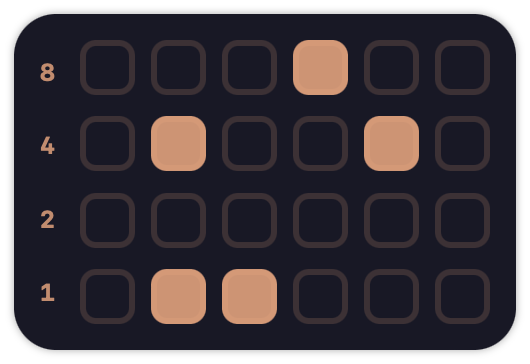
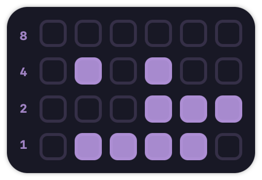

# Desktop Binary Clock

Put a binary clock on your MacOS desktop, based on Catppuccin's color palette (Only for the foreground)!  
This is a project that I made in order to mainly learn more about MacOS's `NSWindow`.  
When the app first launches, you will notice that the main color is Catppuccin's `Text` color. To enter *color selection mode*, simply click the clock once, and you will notice the borders get thicker. The app will automatically cycle through the colors of the Catppuccin palette every second. Once you arrive to a color you like, simply click again to disable *color selection mode*!  

 
